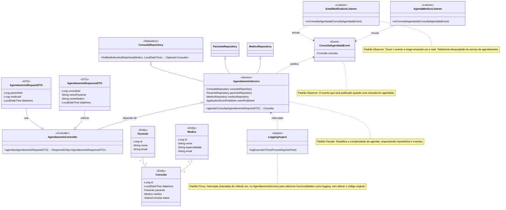

# TODO

## Implementando os padrões de projeto Singleton, Facade, Proxy e Observer

```mermaid

classDiagram
    direction BT

    class AgendamentoController {
        <<Controller>>
        +agendar(AgendamentoRequestDTO): ResponseEntity~AgendamentoResponseDTO~
    }

    class AgendamentoService {
        <<Service>>
        -ConsultaRepository consultaRepository
        -PacienteRepository pacienteRepository
        -MedicoRepository medicoRepository
        -ApplicationEventPublisher eventPublisher
        +agendarConsulta(AgendamentoRequestDTO): Consulta
    }
    note for AgendamentoService "Padrão Facade: Simplifica a complexidade de agendar, orquestrando repositórios e eventos."

    class Consulta {
        <<Entity>>
        -Long id
        -LocalDateTime dataHora
        -Paciente paciente
        -Medico medico
        -StatusConsulta status
    }

    class Paciente {
        <<Entity>>
        -Long id
        -String nome
        -String email
    }

    class Medico {
        <<Entity>>
        -Long id
        -String nome
        -String especialidade
        -String email
    }

    class ConsultaRepository {
        <<Repository>>
        +findByMedicoAndDataHora(Medico, LocalDateTime): Optional~Consulta~
    }

    class AgendamentoRequestDTO {
        <<DTO>>
        -Long pacienteId
        -Long medicoId
        -LocalDateTime dataHora
    }

    class AgendamentoResponseDTO {
        <<DTO>>
        -Long consultaId
        -String nomePaciente
        -String nomeMedico
        -LocalDateTime dataHora
    }

    class ConsultaAgendadaEvent {
        <<Event>>
        -Consulta consulta
    }
    note for ConsultaAgendadaEvent "Padrão Observer: O evento que será publicado quando uma consulta for agendada."

    class EmailNotificationListener {
        <<Listener>>
        +onConsultaAgendada(ConsultaAgendadaEvent)
    }
    note for EmailNotificationListener "Padrão Observer: 'Ouve' o evento e reage enviando um e-mail. Totalmente desacoplado do serviço de agendamento."

    class AgendaMedicoListener {
        <<Listener>>
        +onConsultaAgendada(ConsultaAgendadaEvent)
    }

    class LoggingAspect {
        <<Aspect>>
        +logExecutionTime(ProceedingJoinPoint)
    }
    note for LoggingAspect "Padrão Proxy: Intercepta chamadas de método (ex: no AgendamentoService) para adicionar funcionalidades como logging, sem alterar o código original."


    AgendamentoController o-- AgendamentoRequestDTO : usa
    AgendamentoController o-- AgendamentoResponseDTO : retorna
    AgendamentoController --|> AgendamentoService : depende de

    AgendamentoService --|> ConsultaRepository
    AgendamentoService --|> PacienteRepository
    AgendamentoService --|> MedicoRepository
    AgendamentoService ..> ConsultaAgendadaEvent : publica

    Consulta "1" -- "1" Paciente
    Consulta "1" -- "1" Medico

    ConsultaAgendadaEvent <.. EmailNotificationListener : escuta
    ConsultaAgendadaEvent <.. AgendaMedicoListener : escuta

    LoggingAspect ..> AgendamentoService : intercepta
```